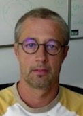

<space>[CNRS](https://www.cnrs.fr) Research Director   
[LIG](https://www.liglab.fr/en) laboratory  
Office 208, [IMAG](https://batiment.imag.fr/) building  
Université Grenoble Alpes  
[700 Av. Centrale, 38400 Saint-Martin-d'Hères](https://maps.app.goo.gl/4XX788DvkZTCWdGT7)  
+33 (0)4 57 42 22 21  
Radu [dot] Iosif [at] univ-grenoble-alpes [dot] fr  

#### Research

- [PhD and internship subjects](subjects.md)
- [Publications](publications.md) (full list on [DBLP](https://dblp.org/pid/81/5510.html))
- [Software](software.md)
- Habilitation Thesis ["Automata and Logics for Program Verification"](hdr.pdf)

#### Funding

- PAVEDYS (2024-2028)
- NARCO (2022-2026)
- VECOLIB (2014-2018)
- VERIDYC (2009-2013)
- AVERILES (2006-2009)
- DYNAMO (2003-2006)

#### Teaching

- [Logic and Automata Theory](lat.md)
- [Introduction to the Theory of Formal Languages](tfl.md)

#### PhD Students/Alumni

- Christoffer Lind Andersen (2025 --) "Verification of Complex Distributed Systems with Broadcast Communication"
- Neven Villani (2024 --) "Automated Verification of Complex Reconfigurable Distributed Systems"
- Lucas Bueri (2021 -- 2024) ["Logics for Reasoning about the Correctness of Reconfigurable Distributed Systems"](https://theses.hal.science/tel-05147758/)
- Xiao Xu (2015 -- 2020) ["Generalisation of Alternating Automata over Infinite Alphabets"](https://theses.hal.science/tel-02964621v1)
- Cristina Serban (2014 -- 2018) ["Automated Reasoning in Separation Logic with Inductive Definitions"](https://theses.hal.science/tel-01908769)
- Filip Konecny (2009 -- 2012) ["Relational Verification of Programs with Integer Data"](https://hal.science/tel-00805599v2)
- Jiri Simacek (2009 -- 2012) ["Harnessing Forest Automata for Verification of Heap Manipulating Programs"](https://theses.hal.science/tel-00805794)

#### Events

- Working Formal Methods Symposium (FROM 2025) Iasi, Romania, September 17-19, 2025 
- An article from the CNRS Information Science Institute website (in French)
- Skolem Award for our 2013 CADE-24 paper The Tree Width of Separation Logic with Recursive Definitions
- Advances in Separation Logics (ASL 2022) Haifa, Israel, July 31st, 2022
- International Joint Conference on Automated Reasoning (IJCAR 2022) Haifa, Israel, August 7-12, 2022
- 14th Summer School on Modelling and Verification of Parallel Processes (MOVEP 2020) June 22-26, 2020, Grenoble
- Second Workshop on Automated Deduction for Separation Logics January 20th, 2020, New Orleans, LA (affiliated with POPL 2020)
- Journées GT Verif 28, 29, 30 May 2018, Grenoble
- First Workshop on Automated Deduction for Separation Logics July 13th 2018, Oxford, UK (affiliated with LICS 2018)
